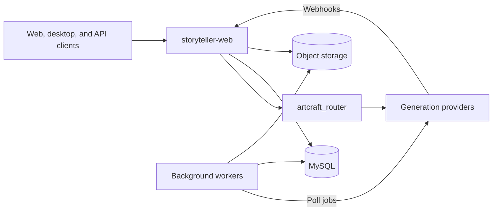

# ArtCraft Services

This repository contains ArtCraft's backend, HTTP API, background workers, and web
frontends. It is a Rust and TypeScript monorepo with shared API definitions,
provider clients, database queries, and development tooling. The checkout also
includes the Tauri desktop application and its shared frontend libraries.

For the product overview, feature demos, and desktop downloads, see
[storytold/artcraft](https://github.com/storytold/artcraft).

## Backend architecture

[`storyteller-web`](./crates/service/web/storyteller_web) is the main HTTP service,
built with Rust, Actix Web, and Tokio. It handles authentication, accounts,
media uploads and libraries, generation requests, job status, credits, and Stripe
billing. The service retains the `storyteller-web` name, and its hosted API uses
`https://api.storyteller.ai`.

Generation spans the HTTP service, provider integrations, and asynchronous workers:



A typical generation request follows this path:

1. The API authenticates the caller, validates the request and input media, and
   checks the user's access and credits.
2. The generation pipeline calculates the cost, bills the wallet, and uses
   [`artcraft_router`](./crates/api_clients/artcraft/artcraft_router) to build and
   submit a provider-specific request. The API records inference jobs in MySQL
   and returns job tokens to the client.
3. Completion is handled through provider webhooks or polling workers, depending
   on the integration. Results are downloaded into object storage, registered as
   media files, and associated with the completed jobs. Separate workers handle
   follow-up processing such as video thumbnails.
4. Clients poll job-status endpoints and load the resulting media through CDN URLs.

Storage responsibilities are split across these components:

| Component                  | Role                                                         |
|----------------------------|--------------------------------------------------------------|
| MySQL + SQLx               | Accounts, media metadata, inference jobs, wallets, and bills |
| Redis                      | Caching, rate limiting, and job progress                     |
| Elasticsearch              | Search indexes and queries                                   |
| S3-compatible storage / R2 | Uploaded media, generated assets, and derived files          |
| SQLite + SQLx              | Local desktop task persistence                               |

HTTP routes and handlers live in
[`storyteller_web/src/http_server`](./crates/service/web/storyteller_web/src/http_server).
MySQL queries belong in the shared
[`mysql_queries`](./crates/schema/database/mysql_queries) crate so that handlers,
workers, and CLI tools use the same data access layer. Reusable billing components
live under [`crates/service/plugins`](./crates/service/plugins), and background
services live under [`crates/service/job`](./crates/service/job).

## HTTP API

The API exposes two generation interfaces:

- **Application endpoints:** `/v1/omni_gen/generate/*` uses user sessions for image,
  video, audio, mesh, and splat generation. `/v1/omni_gen/models/*` and
  `/v1/omni_gen/cost/*` expose model discovery and cost estimation without requiring
  a user session. Application job status is available under `/v1/jobs`.
- **Programmatic endpoints:** `/v1/omni_api` uses an API key in the `Authorization`
  header. It provides image and video generation, image/video/audio uploads, and
  job-status polling. Use `Authorization: Bearer <api-key>`; API access must be
  enabled for the account.

For example, a programmatic video request goes to
`POST /v1/omni_api/generate/video`. The response contains an
`inference_job_token`, which the caller polls with
`GET /v1/omni_api/job_status/job/{token}`. The
[Omni API guide](./_docs/omni_api/artcraft_omni_api.md) covers authentication,
request and response bodies, URL inputs, and runnable examples.

Start with these sources when adding or tracing an endpoint:

- [Route registration](./crates/service/web/storyteller_web/src/http_server/routes/application_routes)
  maps URLs and HTTP methods to handlers for generation, media, users, billing,
  API keys, and other service areas.
- [API definitions](./crates/api_clients/artcraft/artcraft_api_defs) contain shared
  Rust request, response, and error types.
- [Rust API client](./crates/api_clients/artcraft/artcraft_client) and
  [TypeScript API library](./frontend/libs/api) provide client implementations.
- [Provider clients](./crates/api_clients) implement upstream HTTP integrations;
  [the generation router](./crates/api_clients/artcraft/artcraft_router) adapts
  generation requests and cost estimates across providers.

## Frontend

[`frontend`](./frontend) contains the Nx workspace for React and TypeScript apps
and shared libraries. The main web and desktop frontends use Vite, with Zustand
and signals for state, Three.js for 3D scenes, and shared UI and generation tools.

| Path                             | Purpose                                       |
|----------------------------------|-----------------------------------------------|
| `frontend/apps/artcraft-webapp`  | Browser application at `app.getartcraft.com`  |
| `frontend/apps/artcraft-website` | Product website at `getartcraft.com`          |
| `frontend/apps/artcraft`         | Frontend for the Tauri desktop application    |
| `frontend/libs/api`              | HTTP clients, API host selection, and models  |
| `frontend/libs/omni-gen`         | Shared generation logic                       |
| `frontend/libs/components`       | Reusable UI, editors, and generation controls |
| `frontend/libs/tauri-api`        | Frontend bindings for native desktop commands |
| `frontend/libs/tauri-events`     | Desktop event integration                     |

The web apps call the backend through the shared API library, which handles JSON
and multipart requests and session credentials. The desktop frontend also invokes
Rust commands and receives events through Tauri; the native application lives in
[`crates/desktop/artcraft`](./crates/desktop/artcraft).

## Repository layout

```text
artcraft-services/
├── crates/
│   ├── service/web/       # HTTP services, including storyteller_web
│   ├── service/job/       # Provider workers, media processing, analytics
│   ├── service/plugins/   # Shared billing and service components
│   ├── api_clients/       # ArtCraft API types, clients, router, provider clients
│   ├── schema/            # Database access, public tokens/enums, bucket paths
│   ├── lib/               # Shared Rust utilities
│   ├── cli/               # Development and operations tools
│   └── desktop/artcraft/  # Tauri desktop application
├── frontend/
│   ├── apps/              # Web and desktop frontends
│   └── libs/              # Shared TypeScript libraries
├── _database/             # SQL migrations, materialized schemas, search schemas
├── _docs/                 # Setup guides and technical documentation
├── _tools/postman/        # HTTP request collections
├── build/                 # Service Dockerfiles
├── script/                # Development, build, and database tooling
└── Cargo.toml             # Rust workspace
```

## Local development

Use Rust/Cargo for backend work and Node.js/npm for the main frontend workspace.
See the [development setup guide](./_docs/dev_setup.md) for toolchain setup and
[frontend README](./frontend/README.md) for dependency installation and Nx usage.

### Backend

The server needs a migrated MySQL database, Redis, Elasticsearch configuration,
object storage, and credentials for the integrations being exercised. The
[server setup guide](./_docs/dev_setup_server.md) covers local MySQL and Redis;
the remaining configuration is defined in the
[server config directory](./crates/service/web/storyteller_web/config) and
[startup code](./crates/service/web/storyteller_web/src/startup).

In development, the server loads `storyteller-web.common.env`,
`storyteller-web.development.env`, and `storyteller-web.development-secrets.env`
from its configuration search paths: the repository root, `./config`, and the
server's config directory. Its bootstrap skips the root `.env` file.

With the toolchain and service configuration in place, run from the repository root:

```bash
SQLX_OFFLINE=true cargo check -p storyteller-web
SQLX_OFFLINE=true cargo run -p storyteller-web
```

The default bind address is `0.0.0.0:12345`, configurable through `BIND_ADDRESS`.
`GET /_status` exposes the service health check. Provider polling and thumbnail
processing require their corresponding worker processes and configuration.

`SQLX_OFFLINE=true` uses the checked-in `.sqlx` query metadata during compilation;
the running server still needs its databases. When changing SQLx queries, use
[`script/rust/sqlx_codegen_database.sh`](./script/rust/sqlx_codegen_database.sh)
to regenerate metadata against migrated development databases.

### Web frontend

To run the browser app against a local backend:

```bash
cd frontend
npm install
VITE_USE_LOCAL_API=true npx nx dev artcraft-webapp
```

The browser app runs at `http://localhost:4201`. `VITE_USE_LOCAL_API=true` selects
`http://localhost:12345`; without that override, its Vite development proxy targets
the hosted API. API host selection lives in
[`StorytellerApiHostStore`](./frontend/libs/api/src/lib/config/StorytellerApiHostStore.ts).

From `frontend`, build the web app or run the product website with:

```bash
npx nx build artcraft-webapp
npx nx dev artcraft-website
```

The website runs at `http://localhost:4200`. Repository-root launchers are in
[`script/website`](./script/website), and desktop launchers are in
[`script/artcraft`](./script/artcraft).

## Further reading

- [Technical documentation](./_docs)
- [Code conventions](./_docs/code_conventions.md)
- [Database schemas and migrations](./_database)
- [Postman collections](./_tools/postman)
- [Build and development scripts](./script)
- [License](./LICENSE.md)
