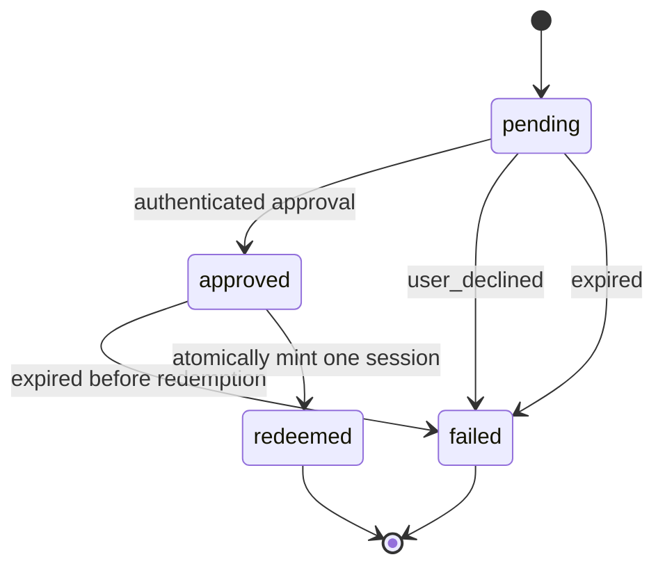

# Website-approved device login

Implemented across storyteller-web, the browser approval page, and the Tauri
login dialog. Apply the two migrations before deploying the API; deploy the web
approval route before releasing the desktop buttons. No production migrations or
deployments were performed while developing this change.

Call the flow **device approval**, and each attempt a **login challenge**. It works
for a desktop browser link or a phone scanning a QR code, regardless of how the
approving account signed in. It creates an ordinary cookie-based web session.

The design borrows separate device/browser credentials, polling, explicit consent,
and code comparison from [OAuth device authorization (RFC 8628)](https://www.rfc-editor.org/rfc/rfc8628.html#section-3.3.1).
It is an ArtCraft session bridge, not an OAuth token endpoint implementation.

## Two migrations

1. `2026-09-25-120000-0000_create_user_login_challenges` creates the challenge and
   its terminal outcome audit record together. A separate failure table is not
   needed for one immutable outcome per attempt. Status is `NOT NULL` without a
   default; inserts explicitly bind `UserLoginChallengeStatus::Pending`.
2. `2026-09-25-120000-0001_alter_user_sessions_add_maybe_creation_type` adds nullable
   provenance to cookie sessions. Existing rows and older writers retain NULL.

Both have reverse migrations and matching materialized schemas under
`migrations_squashed/user_tables/`. Deploy the schema before new writers. Roll
back feature code before dropping the column/table; rollback removes bridge audit
records but does not revoke sessions already issued.

`UserWebSessionCreationType` values:

| Rust variant     | Stored value      | Meaning                                                           |
|------------------|-------------------|-------------------------------------------------------------------|
| DirectLogin      | direct_login      | Password or SSO login/signup, including desktop password login.   |
| DeviceApproval   | device_approval   | A new session minted from an approved login challenge.            |
| Impersonation    | impersonation     | Existing consented staff impersonation flow.                      |
| None             | NULL              | Unknown provenance, including existing rows and older writers.    |

`DirectLogin` describes the creation mechanism more accurately than `Web`, since
ordinary password login is also available in the desktop app. This field does not
replace `maybe_impersonation_user_token` or influence authentication/authorization.
MCP and API credentials continue using `mcp_sessions` and `api_keys` respectively.
Existing password/SSO and impersonation session writers now record provenance.
There is no historical backfill or default that would invent it.

## Credentials and confirmation

Generate two independent 32-byte CSPRNG values per challenge. Encode each as
unpadded base64url (43 ASCII characters). Store only the SHA-256 digest of that
canonical ASCII representation in the two uniquely indexed `BINARY(32)` columns.
Reject noncanonical input instead of accepting multiple representations. These
are random tokens, not passwords, so a fast cryptographic hash is appropriate.

| Value               | Who receives it               | What it permits                                        |
|---------------------|-------------------------------|--------------------------------------------------------|
| token               | Internal logs/support         | Identifying a row; no authentication.                  |
| approval token      | Desktop, browser link, QR     | Review and authenticated approval/decline only.        |
| device token        | Initiating desktop only       | Polling and collecting the newly authorized session.   |
| confirmation code   | Desktop and approval screen   | Visual comparison only; no lookup or authentication.   |

Use eight uniformly random characters from `BCDFGHJKLMNPQRSTVWXZ` for the code.
Store `WDJBMJHT`, display `WDJB-MJHT`, and ask the user to verify the match. It need
not be unique because it is never used to locate or authorize a challenge. Manual
short-code entry is outside this initial flow; both entry points carry the full
approval token. The private device token must never be in the URL or QR code.

The website displays the requesting IP, the account being authorized, the matching
code, and explicit **Approve desktop login** / **Decline** actions. An existing
website session skips only the login screen, never consent. If login is needed,
keep the pending approval context in first-party browser state and resume the
confirmation page after password or Google SSO login. Recheck expiry after login.
Do not send the bridge tokens to Google or another identity provider. Allow only
the fixed first-party return route, not an arbitrary caller-supplied redirect URL.

The approval page is a read-only GET; link scanners and previews cannot decide
the challenge. Decisions require a valid, non-impersonated user web session plus
CSRF/origin protection. Never accept an API key or MCP credential as consent.
Require the user to have initiated the request on a device in their possession;
the visible code and IP help detect phishing but are not authentication factors.

The approval URL uses HTTPS and carries the browser credential in its fragment.
The page captures and removes that fragment before referral collection or React
providers initialize, skips analytics/referral tracking on direct entry, and sets
a no-referrer policy. API responses send `Cache-Control: no-store` and
`Referrer-Policy: no-referrer`; API credentials travel in JSON bodies, never query
strings. Shared fonts and the Google sign-in provider still load. Keep request and
response bodies out of gateway logs. Invalid credentials reveal no account or
challenge details. The IP follows the existing trusted-gateway forwarding policy;
the gateway must replace untrusted incoming forwarding headers.

## State and the 20-minute deadline



Set `created_at = NOW()` and `expires_at = NOW() + INTERVAL 20 MINUTE` in the same
INSERT using the database's clock. The default expiry is immediate so a writer
that omits it fails closed. Neither approval nor polling extends this deadline.
All eligibility checks require `expires_at > NOW()`; equality means expired.
The create query enforces this exact lifetime; these migrations do not add
triggers or database CHECK constraints. Keep database connections in UTC.

The persisted status alone is insufficient to decide validity. A pending or
approved row whose deadline passed is already expired even before a sweeper
marks it `failed`. Approvals and first redemptions must check the deadline again
under the row lock. Polls are normally read-only and do not touch `updated_at`.

| Status     | Required accompanying data                                                          |
|------------|-------------------------------------------------------------------------------------|
| pending    | No decision, failure, redemption, or session reference.                             |
| approved   | Deciding user, decision IP/time; no failure, redemption, or session reference.      |
| redeemed   | Approval data plus session ID, first redemption IP/time; no failure.                |
| failed     | Failure type/time; no redemption or session reference; retain any prior approval.   |

`UserLoginChallengeFailureType` initially has two values:

- `user_declined`: record the deciding user, browser IP in both decision/failure
  IP fields, and the decision time in both decision/failure timestamps. Keep the
  original desktop IP. Polling with the valid device token reports the decline.
- `expired`: record `maybe_failed_at = expires_at`. Retain original desktop IP and
  any prior approval, but leave the failure IP NULL: a timeout has no actor. A
  scheduled sweep records abandoned requests even when nobody polls again.

Failed challenges are unusable for approval or redemption. Their digests and
audit metadata remain for diagnosing failures; do not physically delete the row
when a user declines. A new attempt creates a new row and fresh tokens. Closing
the desktop dialog stops polling; unused requests expire normally.

Invalid tokens, failed website sign-ins, throttling, and transient infrastructure
errors do not terminally fail a valid challenge. Record those requests in the
existing operational/abuse logging with their IP and failure category, without
credentials. A second decision cannot replace the first actor or outcome.

## Atomic redemption and response loss

The website's approval records consent; it never creates or receives the desktop
cookie. The desktop's authenticated poll performs redemption after approval:

1. Begin an InnoDB transaction on the primary and find the challenge by the device
   token digest with `SELECT ... FOR UPDATE`.
2. Validate the immutable deadline and state after taking the lock. Handle
   failed/pending states without creating a session. Revalidate that the approved
   user exists and is permitted to log in under the ordinary session rules.
3. For `approved`, insert a fresh `user_sessions` row owned by the deciding user,
   with `maybe_creation_type = 'device_approval'`, no impersonation, the current
   desktop redemption IP, and the ordinary web-session lifetime.
4. Store its numeric ID, redemption IP/time, and `status = 'redeemed'` on the
   challenge in that same transaction. Generate the signed cookie using
   `HttpUserSessionManager::create_cookie` before commit, so signing failure rolls
   back too. Commit successfully before returning any credential to the caller.

Both approval/decline and redemption must serialize on the same challenge row;
conditional updates include the expected state and the unexpired deadline, and
must check rows affected. SQL for this flow belongs in `mysql_queries`, with
executor/transaction support, not in the web handler. All three Rust enums in this
change are database enums; separate client-facing status/failure enums include
an unknown-value fallback. Desktop callers fail closed on an unknown state.

One-time means **at most one new session per challenge**. If the first successful
HTTP response is lost, a retry with the same device token may return the same
session until the original 20-minute deadline. For `redeemed`, read the linked
session and verify its owner, creation type, absence of impersonation, expiry,
deletion state, and the user's current eligibility before reconstructing its
cookie. Never mint a replacement or resurrect a deleted session. After the
deadline, return expiry without a cookie; the already-issued session keeps its
normal lifetime, and the audit outcome remains `redeemed`.

The unique nullable session ID index prevents two challenges from referencing one
session and supports retries without duplicating bearer credentials in this
table. The reference is intentionally signed because the legacy `user_sessions.id`
is signed. Like neighboring schemas, references are indexed logical links rather
than cascading foreign keys; removal of a session must not erase the audit row.
If the referenced session is missing, redemption fails closed.

## Implemented endpoints and clients

All endpoints are JSON POSTs under `/v1/login_challenges`:

| Endpoint   | Authentication                              | Effect                                                       |
|------------|---------------------------------------------|--------------------------------------------------------------|
| create     | None; limited by requesting IP              | Returns device token, verification URL, code, expiry.        |
| review     | Approval token + web session + Origin       | Returns code, requesting IP, account, state, expiry.         |
| decide     | Approval token + web session + Origin       | Records the first Yes/No; never creates a desktop session.   |
| poll       | Private device token                        | Reports state or atomically redeems approved consent.        |

The API advertises five-second polling. Per-process IP limits are ten creates and
120 other requests per minute, shared across Actix workers, with bounded memory.
Production gateways can additionally enforce aggregate limits across replicas.
A worker expires up to 1,000 abandoned challenges every 30 seconds. Audit retention
is intentionally not an automatic purge policy in this change.

Both browser applications implement `/login/desktop`: `https://getartcraft.com`
(including `www`) and `https://app.getartcraft.com`. They share the approval UI in
`frontend/libs/login`. The API currently advertises the webapp URL. Local API
requests advertise `http://localhost:4201/login/desktop`; the website also handles
the route on port 4200. Run either frontend with `USE_LOCAL_API=1` so approval
reaches the same local API; local origins cannot approve production challenges.
The website signs in inline to preserve its origin-scoped pending token and
mobile session header. The webapp preserves the return destination through login,
signup, and password reset, bypassing billing redirects for desktop consent.
Tokens stay in tab-scoped session storage, are removed from URL fragments before
tracking, and are cleared on terminal results. Returning from authentication
always requires explicit consent. The code stays visible for comparison; a single
Approve or Decline click records the choice, without an extra checkbox.
The desktop displays the QR code, code comparison, countdown, and status. Opening
the website invokes the native system browser. Network errors back off up to 30
seconds; closing the dialog stops polling and cancels the native handle. A response
arriving after cancellation cannot install credentials.

Successful polling returns the signed value and the normal `Set-Cookie` header.
Tauri commands use the Rust `artcraft_client` bindings for creation, polling, and
ordinary session verification, all against `AppEnvConfigs.storyteller_host`. Rust
keeps the private device token and signed session out of IPC/JavaScript; the UI
holds only a local handle and public display data. After verifying the downstream
session, Rust installs and persists the cookie in the native HTTP jar and updates
the credential manager. No browser session is copied into the desktop.
The desktop login/signup modal also uses Rust commands for its initial session
check and password forms. Website/QR buttons appear only in login mode. Unknown
optional feature flags in the session response are ignored by older desktops;
malformed authentication data still fails verification. A stale initial session
check cannot reset a pending or completed login.

## Integration tests

The backend harness uses the fixed local Unix socket `/tmp/mysql.sock` and local
root account. It never reads `DATABASE_URL`, any environment database URL, DNS,
or a TCP endpoint (including localhost SSH forwarding). Each test creates a new
randomly named `artcraft_test_bridge_*` database, replays all migrations, and drops
only its own database on success. Existing `storyteller` and `artcraft_test` data
are not used. A failed test leaves its isolated database for diagnosis. The local
MySQL instance must be running; there is no fallback to a remote database.

The HTTP endpoint suite is
`crates/service/web/storyteller_web/src/http_server/endpoints/login_challenges/endpoint_integration_tests.rs`.
It starts the real challenge handlers and `/v1/session` handler on an ephemeral
`127.0.0.1` port. Separate browser and desktop HTTP clients maintain their own
cookie jars; requests cannot follow redirects or use system proxies. Fixtures in
`mysql_testing::fixtures::login_challenges` create passwordless users, Google email
confirmation, feature flags (including `use_qt`), and signed browser sessions.
The desktop cookie comes only from the real redemption response and is then sent
to the real session endpoint. HTTP responses and SQL queries are not mocked.

From the services repository:

```sh
SQLX_OFFLINE=true cargo test --offline -p storyteller-web --bin storyteller-web login_challenges
cd frontend
npm exec vitest -- run --config apps/artcraft-webapp/vite.config.ts src/pages/login/desktop-login.spec.tsx src/pages/login/login-bridge-continuation.spec.tsx
npm exec vitest -- run --config apps/artcraft-website/vite.config.ts src/pages/login/desktop-login.spec.tsx
```

`SQLX_OFFLINE` controls compile-time query metadata only. These tests still execute
real SQL against local MySQL. Do not enable `skip_database_tests` for this run.

To run only the four HTTP endpoint tests with database fixtures:

```sh
SQLX_OFFLINE=true cargo test --offline -p storyteller-web --bin storyteller-web login_challenges::endpoint_integration_tests
```

From the desktop repository:

```sh
SQLX_OFFLINE=true cargo test --offline -p artcraft --lib login_bridge_tests
cd frontend
npm exec vitest -- run --config libs/components/login-modal/vite.config.ts src/lib/DesktopLoginBridge.spec.tsx src/lib/login-modal.spec.tsx
```

Coverage:

- Four HTTP endpoint integration tests with database fixtures: the complete
  create/review/approve/redeem/session flow, independent browser/desktop cookies,
  passwordless onboarding and `use_qt` serialization, concurrent redemption,
  lost-response recovery with a fresh client, no sessions before redemption,
  audit ownership/IPs/timestamps, decline, pending/approved expiry, downstream
  session revocation/expiry/bans, and immutable approval ownership across accounts.
- Seven additional backend handler integration tests: both production browser origins, passwordless account approval, zero sessions
  before redemption, rejection/audit IPs, token separation, CSRF, MCP rejection,
  invalid approving sessions, concurrent decisions/redemptions, response-loss
  retries, abandoned expiry, expiry during lock contention, revocation, bans,
  signed-cookie authentication through the production session guard, and an issued
  session remaining valid after the challenge expires.
- Twenty-five browser tests: API/consent interaction, code/IP display, decline,
  expiry, terminal/unknown states, lost-response retries, safe return URLs,
  website inline Google/password sign-in, and webapp login/signup/password-reset
  continuation without subscription gating or bridge credentials in SSO requests.
- Thirteen desktop UI tests: IPC-only transport (JavaScript HTTP is forbidden),
  native browser invocation, QR/code values, polling, verified user results,
  decline, timeout, network backoff, cancellation, host/status diagnostics,
  login-only button placement, native password forms, and stale session checks.
- Thirteen native tests: real API bindings against ephemeral loopback HTTP servers,
  downstream verification before cookie installation, persistence, retries,
  rejection, timeout, cancellation during HTTP, unknown states, no redirects,
  redacted errors, local/production origin isolation, visitor-only telemetry,
  forward-compatible feature flags, malformed session data, and native password
  login/signup/session recheck. Desktop tests do not connect to MySQL.

Frontend tests replace external Google/native boundaries; they do not
perform a live Google OAuth exchange or drive a packaged Tauri GUI. Backend tests
use real MySQL and the production cookie signer/session guard with Redis disabled;
the HTTP suite also exercises the real session endpoint and its serialized body.
These endpoint tests do not drive a live Google OAuth exchange or the Tauri GUI.
Existing session-cache TTL behavior is unchanged. SQL lookups now reject expired
sessions; bridge consent/redemption always checks MySQL directly.

Validation also covered both migration directions, nullable compatibility with
legacy session writers, uniqueness constraints, fail-closed expiry defaults, and
matching materialized schemas. The focused web TypeScript check and the production
builds of both browser apps (including 53 dependency tasks) passed. Broad workspace TypeScript
checks have existing errors. The desktop Nx build is blocked by the existing
`api -> tauri-api -> api` cycle; its direct Vite login bundle builds but declaration
checks report unavailable dependency outputs. A source-only desktop check reports
four existing `model-list` imports of `src/index.js`, with no bridge-file errors.
The full native Rust test target compiled successfully.
